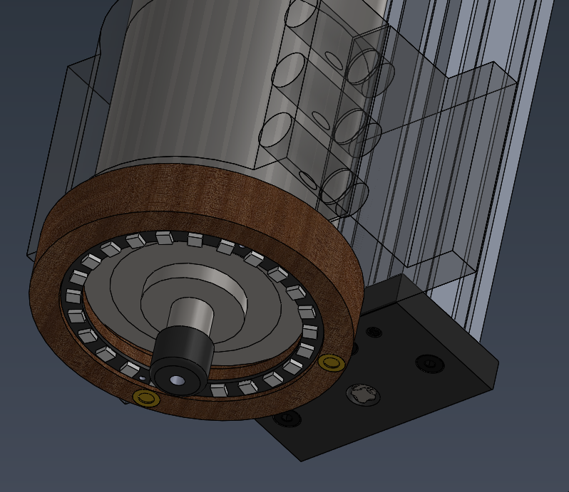
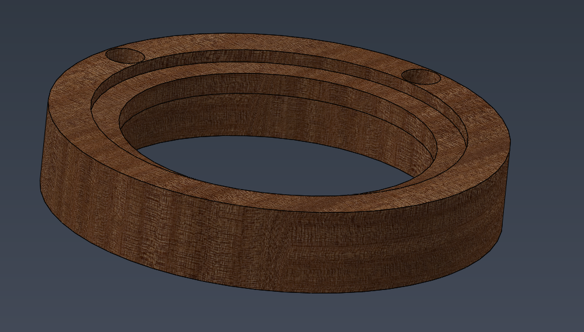
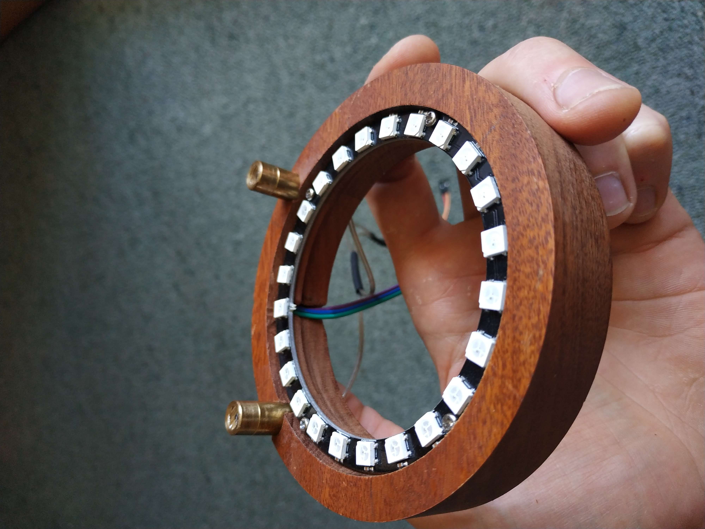
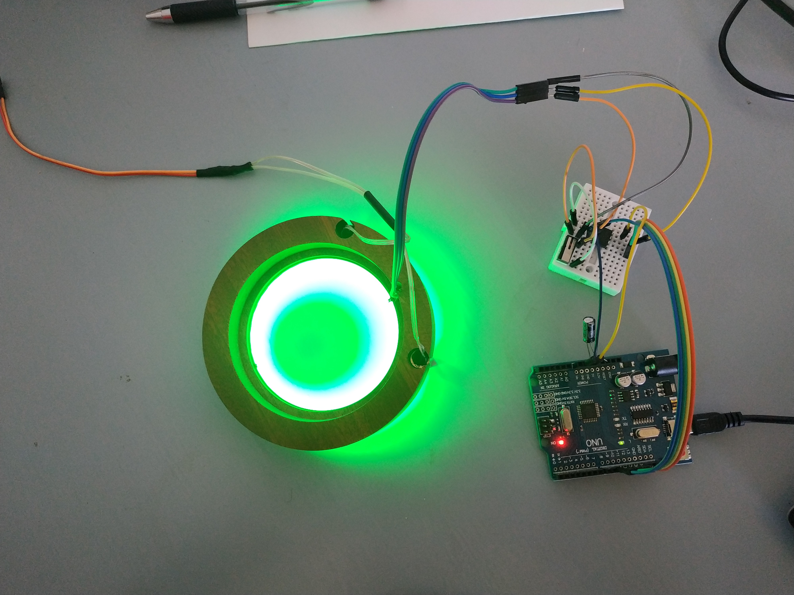
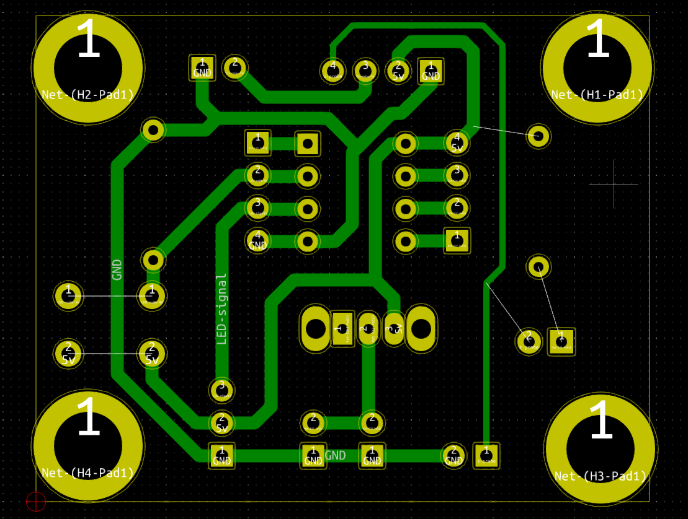
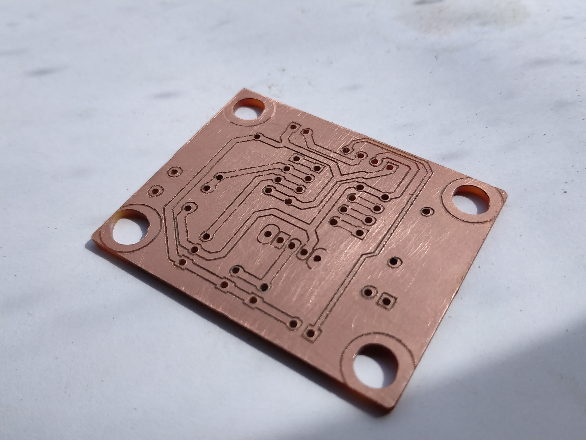
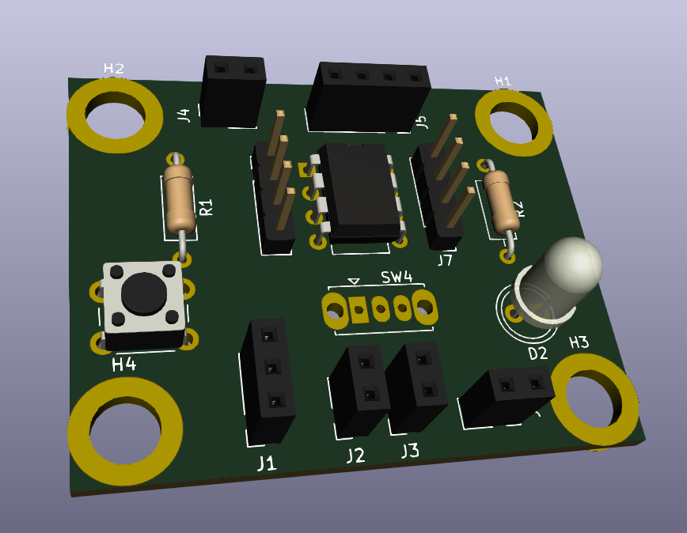

# Circular LED strip PCB for CNC spindle light

This is a PCB and spindle attachment design and software to light up the CNC work area from all sides in any color or sequence desired (as long as you can program it to). The LED control is done by FastLED library, so it's not too hard to create your own sequences.

There is also an option to insert 2 lasers at 90* difference from each other in order to produce a cross shape on XY plane exactly where the tool will touch the work piece. Lasers have their own connectors and on/off switch on the PCB.
There is also a provision for attaching the the Z probe to the pcb, but it is only tested on my own DIY CNC.

You will find here:
- Firmware for ATTiny85
- PCB design
- Spindle mount design

## Final result

  

  

Then milled the wooden mount and attached the LED ring and lasers. I did not insert the lasers fully because later i will need to rotate them to align with center.

  

  

The mounting holes on the PCB align with any 20mm increment profiles such as my 2080 C-beam

  

PCB milled with a 0.2mm HSS bit

  

 

And the assembled PCB

## Parts list

This project requires:
- 1x WS2812B LED strip (circular, 24 LEDs)
- 1x ATTiny85
- 2x line or cross lasers
- 1x button and 1x switch
- some 2.54mm headers and sockets
- 2x THT resistors (10K)
- 1x single-sided copper board
- wooden block for milling the mount from
- 1x arduino uno (only for programming the ATTiny85)

## Usage

1. Mill or 3D print the mount.
2. Mill or etch the PCB at home or get it done by a PCB factory.
3. Upload the firmware to ATTiny85 using your preferred method. I used an arduino UNO as ISP.
4. Solder on all the components (I suggest starting with the smallest ones)
5. Connect the 5v power and LED strip to PCB
6. Press the button to change the LED mode

PM me for questions and comments!
